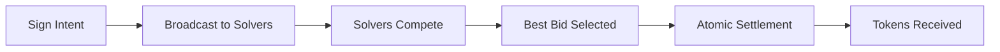

# Intent-Based Trading Aggregator - User Guide

Welcome to the Intent-Based Trading Aggregator! This guide will help you understand and use our revolutionary intent-based trading platform.

## Table of Contents

- [What is Intent-Based Trading?](#what-is-intent-based-trading)
- [Getting Started](#getting-started)
- [Using the Trading Interface](#using-the-trading-interface)
- [Understanding Intents](#understanding-intents)
- [Security Best Practices](#security-best-practices)
- [Troubleshooting](#troubleshooting)
- [Frequently Asked Questions](#frequently-asked-questions)

## What is Intent-Based Trading?

Intent-based trading represents a paradigm shift from traditional DEX interactions. Instead of specifying exact execution paths, you simply express your desired outcome, and our network of competitive solvers finds the best way to achieve it.

### Key Benefits

- **🎯 Simplified UX**: One signature for complex trades
- **🏆 Best Execution**: Competitive solver network ensures optimal pricing
- **⚡ Atomic Settlement**: Your constraints are enforced on-chain
- **🔒 MEV Protection**: Reduced exposure to front-running and sandwich attacks
- **💰 Cost Efficient**: Optimized gas usage and better prices

### Traditional vs Intent-Based Trading

| Traditional DEX | Intent-Based Trading |
|----------------|---------------------|
| Specify exact route | Express desired outcome |
| Multiple signatures | Single signature |
| Manual slippage management | Automatic optimization |
| Exposed to MEV | MEV protection |
| Fixed execution path | Dynamic optimization |

## Getting Started

### Prerequisites

- **Supported Wallets**: MetaMask, WalletConnect, Coinbase Wallet
- **Supported Networks**: X Layer (Chain ID: 196)
- **Minimum Balance**: Small amount of OKB for gas fees

### Connecting Your Wallet

1. **Visit the Application**
   - Go to [https://app.intendly.xyz](https://app.intendly.xyz)
   - Ensure you're on the correct domain to avoid phishing

2. **Connect Wallet**
   ```
   Click "Connect Wallet" → Select your wallet → Approve connection
   ```

3. **Network Setup**
   - The app will prompt you to add X Layer network if not already configured
   - Approve the network addition in your wallet

4. **Verify Connection**
   - Your wallet address should appear in the top right
   - Your OKB balance should be visible

### Adding X Layer Network Manually

If you need to add X Layer manually to your wallet:

```json
{
  "chainId": "0xC4",
  "chainName": "X Layer Mainnet",
  "rpcUrls": ["https://xlayerrpc.okx.com"],
  "nativeCurrency": {
    "name": "OKB",
    "symbol": "OKB",
    "decimals": 18
  },
  "blockExplorerUrls": ["https://www.oklink.com/xlayer"]
}
```

## Using the Trading Interface

### Creating Your First Intent

1. **Select Tokens**
   - **From Token**: Token you want to trade
   - **To Token**: Token you want to receive
   - **Amount**: How much you want to trade

2. **Set Parameters**
   - **Max Slippage**: Maximum acceptable price impact (default: 0.5%)
   - **Deadline**: How long the intent remains valid (default: 20 minutes)
   - **Recipient** (optional): Address to receive tokens (defaults to your address)

3. **Review Intent**
   ```
   From: 1000 USDC
   To: ≥ 0.5998 ETH (minimum expected)
   Max Slippage: 0.5%
   Deadline: 20 minutes
   Fee: ~5 USDC (estimated)
   ```

4. **Sign Intent**
   - Click "Create Intent"
   - Sign the EIP-712 message in your wallet
   - **Note**: This is NOT a transaction, just a signature

### Understanding the Intent Flow



1. **Intent Broadcasting** (Instant)
   - Your signed intent is broadcast to all registered solvers
   - Real-time WebSocket updates show solver activity

2. **Solver Competition** (2-3 seconds)
   - Solvers analyze your intent and submit competing bids
   - You'll see bids appear in real-time with:
     - Expected output amount
     - Solver fee
     - Estimated execution time

3. **Automatic Selection** (Instant)
   - The system automatically selects the best bid based on:
     - Highest output amount for you
     - Lowest total cost
     - Solver reputation score

4. **Settlement** (10-30 seconds)
   - The winning solver executes the trade atomically
   - Smart contract enforces your constraints
   - Tokens are delivered to your specified address

### Monitoring Your Intent

During the process, you can track:

- **📡 Intent Status**: Broadcasted → Bidding → Settling → Completed
- **🏆 Solver Bids**: Real-time competition updates
- **⏱️ Timing**: Countdown to deadline
- **🔗 Transaction**: Link to settlement transaction

### Intent States

| State | Description | Typical Duration |
|-------|-------------|------------------|
| **Broadcasted** | Intent sent to solvers | Instant |
| **Bidding** | Solvers competing | 2-3 seconds |
| **Settling** | Winning solver executing | 10-30 seconds |
| **Completed** | Tokens received | N/A |
| **Expired** | Deadline reached | After deadline |
| **Failed** | Settlement failed | N/A |

## Understanding Intents

### Intent Parameters

#### Token Selection
- **From Token**: Must have sufficient balance + approval
- **To Token**: Any supported token on X Layer
- **Amount**: Can be exact input or target output

#### Slippage Protection
- **Max Slippage**: Maximum acceptable price deviation
- **Minimum Output**: Calculated based on current market price and slippage
- **Price Impact**: Displayed before signing

#### Timing Controls
- **Deadline**: Maximum time for intent to remain valid
- **Settlement Window**: Time allowed for settlement after bid selection

### Advanced Options

#### Custom Recipient
```
By default, tokens are sent to your wallet address.
You can specify a different recipient address.
```

#### Fee Preferences
```
Choose between:
- Lowest Fee: Prioritize lowest solver fees
- Best Price: Prioritize highest output amount
- Fastest: Prioritize quickest execution
```

#### MEV Protection
```
Options:
- Standard: Basic MEV protection
- Enhanced: Maximum MEV protection (may increase costs)
```

## Security Best Practices

### Wallet Security

1. **Hardware Wallets**
   - Use hardware wallets for large amounts
   - Verify transaction details on device screen

2. **Software Wallet Safety**
   - Keep wallet software updated
   - Use strong, unique passwords
   - Enable two-factor authentication where available

3. **Private Key Protection**
   - Never share your private keys or seed phrase
   - Store backup phrases securely offline
   - Use multiple secure locations

### Transaction Security

1. **Verify URLs**
   - Always use [https://app.intendly.xyz](https://app.intendly.xyz)
   - Check for SSL certificate (lock icon)
   - Bookmark the correct URL

2. **Review Signatures**
   ```
   Always verify you're signing:
   ✅ EIP-712 Intent signature
   ❌ Never sign transaction approvals for unknown contracts
   ```

3. **Check Parameters**
   - Verify token addresses
   - Confirm amounts and recipients
   - Review slippage and deadlines

### Smart Contract Interactions

1. **Token Approvals**
   - Only approve tokens you intend to trade
   - Consider using permit-based approvals
   - Revoke unused approvals periodically

2. **Slippage Settings**
   - Don't set slippage too high (avoid sandwich attacks)
   - Don't set slippage too low (may cause failures)
   - Recommended: 0.5% - 2% depending on market conditions

3. **Amount Verification**
   - Double-check decimal places
   - Verify you have sufficient balance
   - Account for gas fees in native token

### Red Flags to Avoid

🚨 **Never do these things:**
- Share your private keys or seed phrase
- Sign transactions on suspicious websites
- Approve unlimited token spending for unknown contracts
- Ignore wallet security warnings
- Use public WiFi for trading
- Store large amounts on exchange wallets

## Troubleshooting

### Common Issues and Solutions

#### Connection Issues

**Problem**: Wallet won't connect
```
Solutions:
1. Refresh the page and try again
2. Clear browser cache and cookies
3. Disable ad blockers and privacy extensions
4. Try a different browser or incognito mode
5. Update your wallet extension
```

**Problem**: Wrong network displayed
```
Solutions:
1. Switch to X Layer in your wallet
2. Add X Layer network if not present
3. Refresh the page after switching networks
```

#### Trading Issues

**Problem**: "Insufficient balance" error
```
Possible causes:
1. Not enough token balance
2. Insufficient OKB for gas fees
3. Token balance not updated (refresh page)
4. Amount exceeds available balance
```

**Problem**: No solver bids received
```
Possible causes:
1. Token pair not supported
2. Amount too small/large for current liquidity
3. Network connectivity issues
4. All solvers offline (rare)

Solutions:
1. Try a different token pair
2. Adjust the amount
3. Check your internet connection
4. Wait and try again later
```

**Problem**: Intent expired without settlement
```
Possible causes:
1. Network congestion
2. Solver execution failed
3. Insufficient gas price

Solutions:
1. Create a new intent with longer deadline
2. Increase gas price if prompted
3. Try during less congested times
```

#### Settlement Issues

**Problem**: Settlement transaction failed
```
Common reasons:
1. Slippage exceeded during execution
2. Insufficient liquidity at execution time
3. Token balance changed after signing
4. Smart contract reverted

What happens:
- No tokens are transferred
- Only solver pays gas fees
- You can create a new intent immediately
```

### Getting Help

If you encounter issues not covered here:

1. **Check System Status**
   - Visit [https://status.intendly.xyz](https://status.intendly.xyz)
   - Check for known issues or maintenance

2. **Community Support**
   - Join our [Discord](https://discord.gg/intendly)
   - Follow [@intendly](https://twitter.com/intendly) for updates

3. **Contact Support**
   - Email: support@intendly.xyz
   - Include: wallet address, transaction hash, error message

## Frequently Asked Questions

### General Questions

**Q: What makes intent-based trading different?**

A: Traditional DEXs require you to specify exactly how to execute your trade (which pools, routes, etc.). With intent-based trading, you simply specify what you want to achieve, and our network of solvers competes to find the best execution path for you.

**Q: Is my money safe?**

A: Yes. You only sign an intent (not a transaction), and our smart contracts enforce your constraints atomically. Your tokens never leave your wallet until the exact moment you receive what you requested.

**Q: How much does it cost?**

A: You pay:
- Solver fees (typically 0.05% - 0.3% of trade amount)
- Gas fees (paid by the solver, but reflected in the final price)
- No additional protocol fees

### Trading Questions

**Q: How long does a trade take?**

A: Typical timeline:
- Intent creation: Instant
- Solver bidding: 2-3 seconds
- Settlement: 10-30 seconds
- Total: Usually under 1 minute

**Q: What happens if no one bids on my intent?**

A: Your intent will expire after the deadline with no cost to you. This is rare but can happen for:
- Very small amounts
- Exotic token pairs
- Extreme market conditions

**Q: Can I cancel an intent?**

A: Intents cannot be cancelled once signed, but they automatically expire after the deadline. Future versions may include cancellation features.

**Q: What's the minimum trade size?**

A: There's no hard minimum, but very small trades (under $10) may not attract solver bids due to gas costs exceeding potential profits.

### Technical Questions

**Q: Which tokens are supported?**

A: Any ERC-20 token on X Layer with sufficient liquidity. The interface shows available tokens, and solvers determine if they can execute your specific trade.

**Q: How is the price determined?**

A: Solvers compete to offer you the best price by:
- Aggregating across multiple DEXs
- Optimizing routing strategies
- Factoring in gas costs and fees
- Competing for solver rewards

**Q: What if the market moves against me during settlement?**

A: Your intent includes slippage protection. If the market moves beyond your specified slippage tolerance, the settlement will fail and you'll need to create a new intent.

**Q: Can I trade with partial fills?**

A: Currently, all intents are all-or-nothing. Partial fills are not supported, but this feature is planned for future releases.

### Security Questions

**Q: How do I know the smart contracts are secure?**

A: Our smart contracts have been:
- Audited by professional security firms
- Tested extensively with automated testing
- Open-sourced for community review
- Deployed with time-locks and upgrade controls

**Q: What data do you collect?**

A: We collect minimal data:
- Public wallet addresses for functionality
- Trade data for analytics (anonymized)
- No personal information or private keys
- Full privacy policy available at [privacy.intendly.xyz]

**Q: What happens if the website is down?**

A: The smart contracts continue operating independently. Solvers can still settle existing intents, and you can interact directly with contracts if needed.

### Solver Questions

**Q: How are solvers selected?**

A: The system automatically selects the bid that provides:
1. The highest output amount for you
2. The lowest effective cost
3. From a solver with good reputation

**Q: What if a solver fails to settle?**

A: If settlement fails:
- You keep your original tokens
- The solver may be penalized
- You can immediately create a new intent
- No cost to you

**Q: Can anyone become a solver?**

A: Yes! Solver participation is permissionless. Check our [Solver Guide](./solver-guide.md) for details on running a solver.

---

## Need More Help?

- 📖 **Documentation**: [docs.intendly.xyz](https://docs.intendly.xyz)
- 💬 **Discord**: [discord.gg/intendly](https://discord.gg/intendly)
- 🐦 **Twitter**: [@intendly](https://twitter.com/intendly)
- 📧 **Email**: support@intendly.xyz

*Happy trading! 🚀*