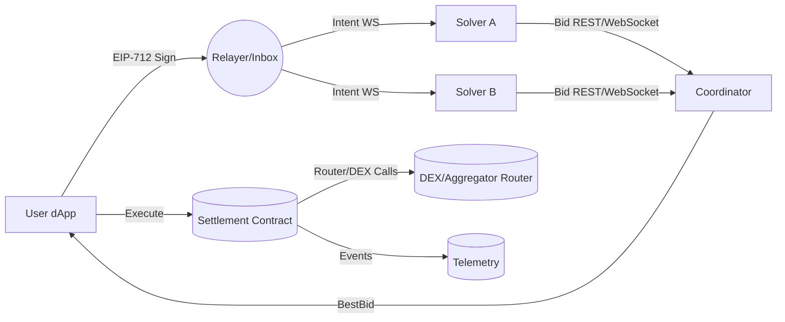

# Intent‑Based Trading Aggregator on L2s — Product Requirements Document (PRD)

> **Hackathon-ready, end‑to‑end MVP spec**

---

## 1) TL;DR
Build an **intent-first swap** experience on L2s where users state *what outcome they want* (e.g., “swap 0.5 ETH → USDC with ≤0.5% slippage by time T”), and a **market of solvers** competes to execute the best trade across DeFi venues. We’ll ship:
- A **one‑screen dApp** (connect wallet → sign intent → watch solver bids → execute best fill).
- A **relayer/inbox + coordinator** that broadcasts intents, admits bids, and selects winners.
- A **settlement smart contract** (X Layer first) using **Permit2** for smooth approvals and calling a DEX router/aggregator.
- A **reference solver** + **solver SDK** so anyone can join the market.

**Default chain:** X Layer (EVM L2), with an easy switcher to add more L2s post‑MVP.

---

## 2) Problem & Opportunity
- **Today’s UX:** Users must choose routes/DEXes and manage approvals; results vary by aggregator and timing.
- **Gap:** Users want **outcomes**, not routes; builders want an open way to compete on execution quality.
- **Opportunity:** Intent-based flow + solver competition can **improve price, latency, and transparency** while staying gas‑ and fee‑efficient on L2s.

---

## 3) Goals, Non‑Goals, Success Metrics
### Goals
1. **Outcome‑driven swapping** with transparent constraints (amountIn/Out, slippageBps, deadline).
2. **Open solver market**: documented interface, permissionless local dev; simple allowlist for mainnet safety.
3. **Low-friction UX**: one signature (EIP‑712) + Permit2 pull; single click to settle.
4. **X Layer-first**: fast, cheap execution; pave path to expand to other L2s.

### Non‑Goals (MVP)
- Cross‑chain bridging, batch intents, RFQ for long‑tail tokens, privacy/pseudo‑dark routing, perpetuals.
- DAO/governance token; complex solver slashing.

### Success Metrics (MVP)
- **P1 Demo:** < 2 min end‑to‑end flow; ≥2 distinct solvers responding in < 3s.
- **Price quality:** ≥20 bps avg improvement vs baseline route (demo dataset).
- **Reliability:** ≥99% success in happy‑path swaps for blue‑chip pairs on test amounts.
- **UX:** ≤1 mandatory signature pre‑settlement; < 30s from “Sign” to “Settled” on a healthy network.

---

## 4) Personas
- **Retail Swapper “Ria”**: wants best price quickly, hates approvals and scary settings.
- **Solver Operator “Sam”**: can run infra and integrate DEX APIs/onchain paths; wants clear, fair economics.
- **Judge/Reviewer “Jules”**: needs to see novelty, real execution, clean code, and future potential.

---

## 5) User Journeys
1. Ria connects wallet → chooses L2 (default X Layer) → enters intent (tokenIn/out, amountIn, maxSlippage, deadline) → **Sign**.
2. Coordinator broadcasts intent → **solvers bid** (quoteOut, fee, path hint).
3. Best bid displayed → user **Execute** → settlement contract pulls tokenIn via Permit2, calls router, pays solver fee, and returns tokenOut.
4. Post‑trade: show **achieved price**, **savings vs baseline**, **solver payout**, and a link to explorer.

---

## 6) Scope
### MVP
- Single‑chain L2 (X Layer), spot swaps for ERC‑20s.
- EIP‑712 intent signing, relayer, WS broadcast, bid selection, settlement.
- Permit2 integration; 1–2 DEX routes via an aggregator/router.
- Reference solver + minimal SDK (TypeScript) + simple allowlist registry.

### Stretch (time‑boxed, optional)
- Add second L2 (Base/OP), gas sponsorship for the settle tx, ERC‑7521 compatibility, more solvers, price‑improvement scoreboard.

---

## 7) Functional Requirements
### 7.1 Intents (Off‑chain)
- **Fields**
  - `tokenIn` (address), `tokenOut` (address), `amountIn` (uint256), `maxSlippageBps` (uint16), `deadline` (uint64, unix), `chainId` (uint256), `receiver` (address), `nonce` (uint256).
- **Signature**: EIP‑712 with domain `{name:"IntentSwap", version:"1", chainId, verifyingContract:settlementContract}`.
- **Validation**: wallet must own `amountIn` and have Permit2 allowance at settle time; `deadline` must be in the future; `maxSlippageBps ≤ 500` (5%).

### 7.2 Bidding (Solvers)
- **Broadcast**: relayer emits new intents over WS.
- **Bid** includes: `intentHash`, `quoteOut` (uint256), `solverFeeBps` (≤ 30), `calldataHint` (bytes/URI), `ttlMs`, `solverSig` (EdDSA/ECDSA over payload), `solverAddress`.
- **Selection**: coordinator computes `score = quoteOut * (1 - solverFeeBps/10000)`. Highest score wins; tie‑break: earliest bid.

### 7.3 Settlement (On‑chain)
- Contract checks: user intent signature, expiry, nonce unused, `minOut = amountIn * (1 - slippage)`.
- Pulls `amountIn` via Permit2 (`permitWitnessTransferFrom`) from user; calls router/aggregator with solver‑supplied calldata; enforces `minOut`.
- Pays `solverFee` from output; sends remainder to `receiver`.
- Emits events: `IntentFilled`, `SolverPaid`, `Failure(reason)`.

---

## 8) Non‑Functional Requirements
- **Security**: ReentrancyGuard; checks on external call success; revert on bad quotes; guarded external calls; minimal trusted surface.
- **Privacy**: No PII; intents stored temporarily; redact addresses in analytics where possible.
- **Performance**: broadcast latency < 500ms; allow 2‑3s bidding window.
- **Reliability**: coordinator redundant process; idempotent settlement via `intent nonce` mapping.
- **Observability**: metrics for intent count, bids/intent, time‑to‑first‑bid, fill rate, price improvement; logs structured JSON.

---

## 9) Architecture


**Components**
- **Frontend dApp**: Next.js/React + wagmi/viem; 1‑page flow.
- **Relayer/Inbox**: receives signed intents (HTTP POST), validates basic fields, broadcasts on WS, persists in Redis/DB.
- **Coordinator**: collects bids for an intent until `biddingWindowMs`, chooses best bid, returns to UI.
- **Solver SDK**: TS lib wrapping quote sources (aggregator API, onchain routers), packaging bids and signing.
- **Settlement Contract**: EVM solidity; owns Permit2 pull + router call + fee payout; immutable references to Permit2, router, fee treasury.

---

## 10) Data Model (Server‑side)
**Tables/Collections**
- `intents`: `{intentHash, payload, signer, status: NEW|SELECTED|FILLED|EXPIRED, createdAt}`
- `bids`: `{intentHash, solverId, quoteOut, solverFeeBps, payloadURI, arrivedAt}`
- `fills`: `{intentHash, txHash, solverId, amountOut, solverFeePaid, timestamp}`
- `solvers`: `{solverId, pubkey, metadata, isAllowed}`

Indexes: `(intentHash)`, `(solverId, arrivedAt)`, `(status)`.

---

## 11) APIs (Relayer/Coordinator)
### HTTP
- `POST /intents`
  - Body: `{intent, signature}`
  - Returns: `{intentHash, biddingWindowMs}`
- `GET /intents/:hash/bestBid`
  - Returns: `{bid|null}`
- `POST /bids`
  - Body: `{intentHash, quoteOut, solverFeeBps, calldataHint|uri, ttlMs, solverSig}`
  - Auth: solver key (header `X-Solver-Id` + signature header)

### WebSocket Channels
- `ws /stream` → messages:
  - `IntentCreated {intentHash, intentSummary}`
  - `BidReceived {intentHash, solverId, quoteOut, solverFeeBps}`
  - `BestBidUpdated {intentHash, bid}`

### Rate Limits
- Public: 10 req/s/IP; Solvers: 50 req/s.

---

## 12) Intent & Bid Schemas (EIP‑712)
**Domain**
```json
{
  "name": "IntentSwap",
  "version": "1",
  "chainId": 196, // example; replace per network
  "verifyingContract": "0xSettlement..."
}
```

**Types**
```json
{
  "Intent": [
    {"name":"tokenIn","type":"address"},
    {"name":"tokenOut","type":"address"},
    {"name":"amountIn","type":"uint256"},
    {"name":"maxSlippageBps","type":"uint16"},
    {"name":"deadline","type":"uint64"},
    {"name":"chainId","type":"uint256"},
    {"name":"receiver","type":"address"},
    {"name":"nonce","type":"uint256"}
  ]
}
```

**Example to sign**
```json
{
  "tokenIn":"0xeeee...", "tokenOut":"0xa0b8...", "amountIn":"500000000000000000",
  "maxSlippageBps":50, "deadline": 1754900000, "chainId": 196,
  "receiver":"0xUser...", "nonce": 1
}
```

---

## 13) Smart Contract Spec (Solidity)
**Contract**: `IntentSettlement`

**Constructor params**: `{address permit2, address router, address feeTreasury, uint16 maxFeeBps}`

**Storage**
- `mapping(bytes32 => bool) usedNonce` (by signer: pack with address)
- `address permit2; address router; address feeTreasury; uint16 maxFeeBps;`

**External**
```solidity
function submitAndSettle(
  Intent calldata intent,
  bytes calldata userSig,
  BidLike calldata selectedBid,
  bytes calldata routerCalldata
) external nonReentrant;
```

**Checks & Effects**
1. Verify `userSig` (EIP‑712) and `!usedNonce[hash(signer, nonce)]`.
2. `require(block.timestamp ≤ intent.deadline)`.
3. Compute `minOut = amountIn * (10000 - maxSlippageBps)/10000`.
4. Pull `amountIn` via Permit2 `permitWitnessTransferFrom`.
5. `router.call(routerCalldata)`; decode `amountOut`.
6. Compute `fee = amountOut * solverFeeBps/10000`; transfer `fee` to `selectedBid.solver` and remainder to `intent.receiver`.
7. Emit `IntentFilled(intentHash, signer, tokenIn, tokenOut, amountIn, amountOut, solver, fee)`.

**Events**
```solidity
event IntentFilled(bytes32 intentHash, address user, address tokenIn, address tokenOut, uint256 amountIn, uint256 amountOut, address solver, uint256 fee);
event RouterFailure(bytes32 intentHash, bytes reason);
```

**Errors**
```
error InvalidSignature();
error ExpiredIntent();
error SlippageExceeded();
error FeeTooHigh();
```

**Security Notes**
- Reentrancy guards; checks‑effects‑interactions.
- Validate router target against allowlist.
- Limit `maxFeeBps` to protect users.

---

## 14) Solver Protocol & Economics
- **Joining**: register solver pubkey (allowlist for demo); receive WS intents.
- **Bidding Window**: default 2000–3000 ms. Bids must include `ttlMs`.
- **Scoring**: `effectiveOut = quoteOut * (1 - feeBps/10000)`; highest wins.
- **Payment**: on success, fee paid from output token. On revert, no fee.
- **Fairness**: all solvers receive the same intent payload at the same time (broadcast log + timestamps).

---

## 15) Fees & Treasury
- **Platform fee** (optional for MVP): 0–5 bps from solver fee; remainder to solver.
- **Treasury**: configurable address; events expose amounts.

---

## 16) Validation & Testing
- **Unit tests**: signature verification, minOut math (edge bps), router success/fail paths, fee calc, nonce reuse.
- **Property/Fuzz**: random slippage/amounts; revert reasons preserved.
- **Fork tests**: mainnet‑fork of target L2 (router address), simulate a real swap.
- **Load**: 100 intents/min, two solvers; ensure coordinator picks consistently.
- **Test vectors**: JSON fixtures for intent → bid → settlement outcomes.

---

## 17) Observability
- **Frontend**: capture time‑to‑first‑bid, best‑bid delta, execution time.
- **Backend**: intents created, bids/intent, dropped bids, selection latency, fail reasons.
- **On‑chain**: index `IntentFilled` events; simple dashboard (blocks → fills → bps saved).

---

## 18) Rollout & Environments
- **Local**: Hardhat Anvil; mock router + mock ERC‑20s.
- **Testnet**: X Layer testnet; small faucets; real router.
- **Mainnet (demo)**: X Layer mainnet with tiny notional.
- **Config**
  - `PERMIT2_ADDRESS`, `ROUTER_ADDRESS`, `FEE_TREASURY`, `CHAIN_ID`.

---

## 19) Security & Risk
- **Router risk**: call only vetted router(s); revert on short/invalid return data.
- **Slippage/MEV**: enforce minOut; suggest tight deadlines (<5 min); settlement as a single atomic tx.
- **Key handling**: store solver keys server‑side; rotate via env; rate limit.
- **Abuse**: caps on `amountIn`, denylist tokens, simple AML heuristics (no blacklisted tokens for demo).

---

## 20) Compliance (Hackathon‑level)
- No custody; user‑initiated atomic swaps; no KYC in MVP. Add disclaimers in UI; show risks and test‑only nature.

---

## 21) Developer Experience
**Repo Structure**
```
/contract
  IntentSettlement.sol
  interfaces/
  test/
/relayer
  src/ (Express/Fastify)
  ws/
  prisma/ (or drizzle)
/solver-sdk
  src/
  examples/reference-solver/
/web
  pages/
  components/
  hooks/
  lib/
```

**ENV Vars**
```
RPC_URL, CHAIN_ID, PERMIT2_ADDRESS, ROUTER_ADDRESS,
FEE_TREASURY, COORDINATOR_URL, WS_URL,
SOLVER_PRIVATE_KEY (local only),
NEXT_PUBLIC_CHAIN_ID, NEXT_PUBLIC_WS_URL
```

---

## 22) Roadmap & Milestones (Hackathon)
**Day 0–0.5**: Contracts scaffold, EIP‑712 + Permit2 wiring, basic UI.
**Day 0.5–1**: Relayer WS + best‑bid selection; reference solver with 1 route.
**Day 1–1.5**: E2E on testnet + explorer links; metrics panel.
**Day 1.5–2**: Second solver; polish UI; record demo; finalize README.

---

## 23) Acceptance Criteria (MVP)
- Can perform a swap of `0.5 ETH → USDC` on X Layer with ≤0.5% slippage, within 2 clicks post‑connect.
- At least 2 solver bids arrive within 3s; best bid auto‑selected and shown.
- Settlement tx succeeds; UI shows achieved `amountOut`, bps saved vs baseline, and solver fee.
- All core events emitted; logs available; contracts verified.

---

## 24) Demo Script
1. Connect wallet; choose **X Layer**.
2. Fill intent: `0.5 ETH → USDC`, `slippage 0.5%`, `deadline = now + 5m` → **Sign**.
3. Watch two solver bids appear; show best bid and explain fee.
4. **Execute**; open explorer link; show receipt + metrics panel.

---

## 25) Open Questions
- Do we expose the exact router calldata to users (transparency) or just a route summary?
- Should we do a commit‑reveal auction to reduce copy‑trading between solvers?
- Minimum viable anti‑spam for intents (stake, captcha, or small relayer fee)?

---

## 26) Appendix
### A) Example EIP‑712 Typed Data (TS)
```ts
export const domain = (chainId:number, verifyingContract:string) => ({
  name: "IntentSwap",
  version: "1",
  chainId,
  verifyingContract,
});

export const types = {
  Intent: [
    { name: "tokenIn", type: "address" },
    { name: "tokenOut", type: "address" },
    { name: "amountIn", type: "uint256" },
    { name: "maxSlippageBps", type: "uint16" },
    { name: "deadline", type: "uint64" },
    { name: "chainId", type: "uint256" },
    { name: "receiver", type: "address" },
    { name: "nonce", type: "uint256" },
  ],
};
```

### B) Minimal ABI Snippet
```json
[
  {"type":"function","name":"submitAndSettle","stateMutability":"nonpayable","inputs":[
    {"name":"intent","type":"tuple","components":[
      {"name":"tokenIn","type":"address"},
      {"name":"tokenOut","type":"address"},
      {"name":"amountIn","type":"uint256"},
      {"name":"maxSlippageBps","type":"uint16"},
      {"name":"deadline","type":"uint64"},
      {"name":"chainId","type":"uint256"},
      {"name":"receiver","type":"address"},
      {"name":"nonce","type":"uint256"}
    ]},
    {"name":"userSig","type":"bytes"},
    {"name":"selectedBid","type":"bytes"},
    {"name":"routerCalldata","type":"bytes"}
  ],"outputs":[]}
]
```

### C) Reference Solver (Pseudo‑TS)
```ts
const onIntent = async (intent) => {
  // 1) Fetch quotes from aggregator / onchain router
  const quoteOut = await getBestQuote(intent);
  const feeBps = 10; // 0.10% fee example
  const payloadURI = await storeCalldataHint(intent, quoteOut);
  const bid = { intentHash: intent.hash, quoteOut, solverFeeBps: feeBps, ttlMs: 3000, payloadURI };
  bid.solverSig = signBid(bid, SOLVER_PRIVATE_KEY);
  await post('/bids', bid, { headers: solverAuthHeaders });
};
```

### D) Frontend Wireframe (One Page)
- **Top bar**: Network selector (X Layer default), wallet status.
- **Card**: `tokenIn`, `amountIn`, `tokenOut`, `slippage`, `deadline` → **Sign**.
- **Live bids**: table updating every 200 ms; badge for best bid.
- **Execute** button (enabled once a best bid exists).
- **Post‑trade**: receipt, price vs baseline, solver fee, explorer link.

### E) Glossary
- **Intent**: a signed order describing desired outcome and constraints.
- **Solver**: an agent that proposes a concrete way to fulfill an intent.
- **Relayer/Coordinator**: off‑chain services to disseminate intents and select bids.
- **Permit2**: approval system enabling token transfers by third parties via signed permits.

---

## 27) License & Attribution
- Code: MIT (hackathon‑friendly). UI marks are placeholders; verify trademarks before public launch.

---

*End of PRD*

